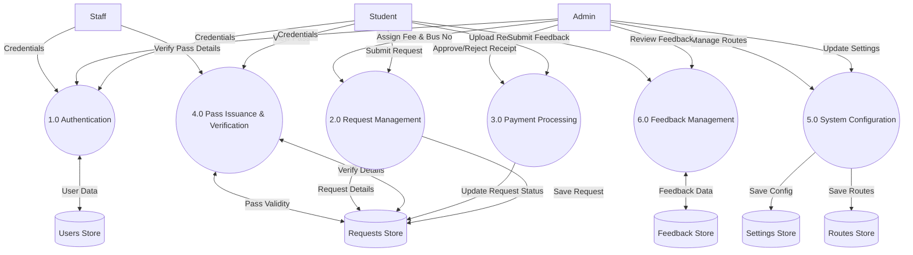
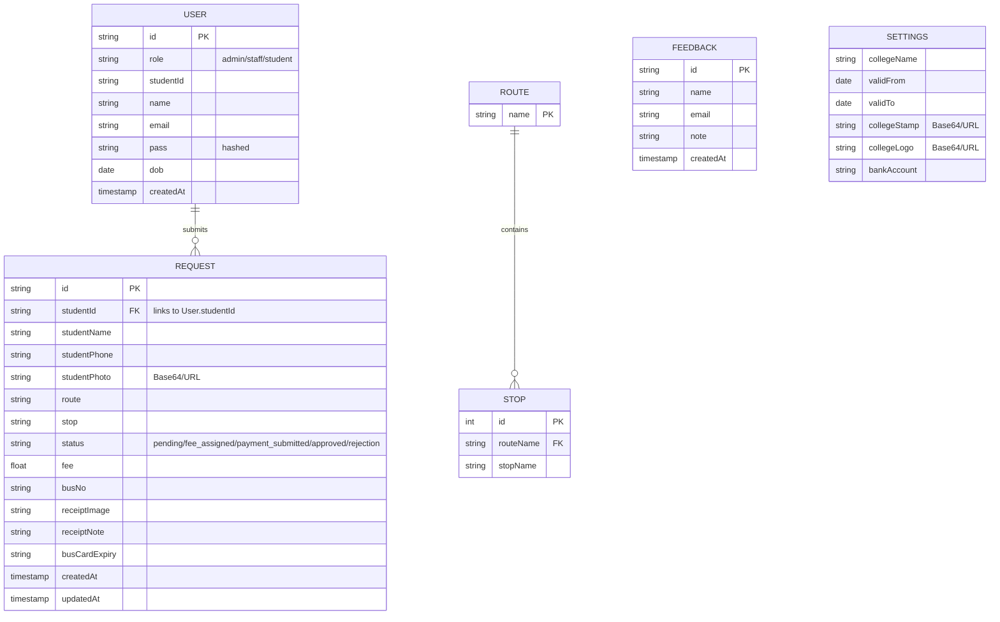

# DigiBus Project Diagrams

This document contains the Data Flow Diagram (DFD) and Entity-Relationship (ER) Diagram for the DigiBus project.

## 1. Data Flow Diagram (DFD - Level 1)

The DFD illustrates how information flows through the DigiBus system between external entities (Students, Admins, Staff) and the internal processes/data stores.

---

## 2. Entity-Relationship (ER) Diagram

The ER diagram defines the database structure, showing the entities, their attributes, and how they relate to one another.

### Key Relationships:
- **User to Request**: A Student (User) can submit one or more bus pass requests (though typically one active at a time).
- **Route to Stop**: A Route is composed of multiple physical bus stops.
- **Settings**: A global singleton entity that stores system-wide configuration (College name, logo, validity period).
